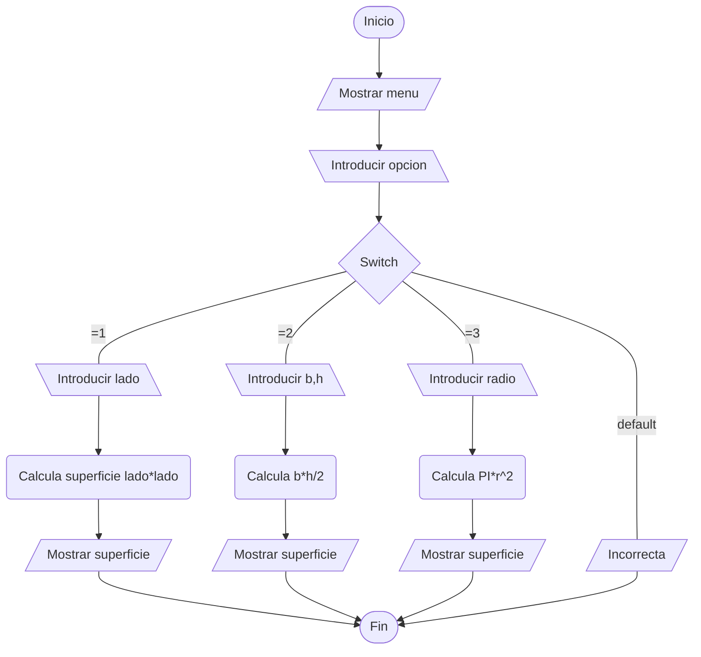

```mermaid
graph TD;
    A([Inicio])-->B[/Mostrar menu/];
    B-->C[\Introducir opcion\];
    C-->D{Switch};
    D---|=1|E[\Introducir lado\];
    E-->e1(Calcula superficie lado*lado);
    e1-->e2[/Mostrar superficie/];
    D---|=2|F[\Introducir b,h\];
    F-->f1(Calcula b*h/2);
    f1-->f2[/Mostrar superficie/];
    D---|=3|G[\Introducir radio\];
    G-->g1(Calcula PI*r^2);
    g1-->g2[/Mostrar superficie/];
    D---|default|H[/Incorrecta/];  
    e2-->I([Fin]);
    f2-->I([Fin]);
    g2-->I([Fin]);
    H-->I([Fin]);
```
